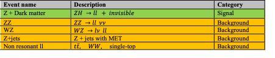
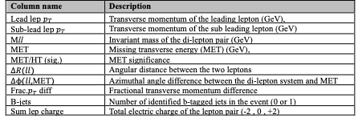

# Histogram Analyser to Find Dark Matter

## Introduction
This histogram analyser is an interactive visualisation tool built to explore ATLAS collaboration’s search to find dark matter signals specifically targeting the channel: 

$pp \rightarrow ZH \\; Z \rightarrow l^{+}l^{-} \\: H \rightarrow \text{invisible}$ 

In this search channel proton-proton collision results in associated production of a Z boson and a Higgs boson, where the Z boson decays into a pair of charged leptons 
(electrons or muons), and the Higgs boson decays invisibly, as detailed in the publication by the ATLAS Collaboration 
[“Search for associated production of a Z boson with an invisibly decaying Higgs boson or dark matter candidate at 13 TeV with the ATLAS detector"](https://www.sciencedirect.com/science/article/pii/S0370269322002003?ref=pdf_download&fr=RR-2&rr=9a843f75bcc593da).

This histogram analyser replicates key elements of the ATLAS analysis using data provided by ATLAS Open Data. 
This search was conducted using the full Run-2 dataset, corresponding to an integrated luminosity of 139 fb⁻¹ at a centre-of-mass energy of 13 TeV. 

This interactive histogram analyser displays stacked histograms of key observables and allows users to dynamically select events, apply variable filters to visualise how 
signal characteristics like large $E_{T}^\text{miss}$ or small $\Delta{}R$ or $\Delta\phi(ll,E_{T}^\text{miss})$ help distinguish signal from background and isolate rare 
processes that might hint at new physics.

## Physics motivation

The discovery of the Higgs boson has opened new portals to search for dark matter (DM) and other beyond-the-Standard-Model phenomena. One compelling theory suggests the Higgs can decay into stable invisible particles that escape detection (a hallmark of DM candidates).
The $ZH \rightarrow l^{+}l^{-} + \text{invisible}$ channel is a powerful search channel because of three considerations:
- The $Z$ boson decay to charged leptons is clean and well-reconstructed.
- The invisible Higgs decay results in large missing transverse energy (MET).
- Backgrounds can be systematically studied and suppressed.
The Histogram Analyzer is built to help study and visualize the discriminating variables between signal and background.

## Signal and background events 

The final state of interest - the signal is - is made up of 
- Two oppositely charged leptons, 
- with invariant mass consistent with a Z boson, and 
- high missing transverse energy (MET).

The dominant background events in this search mimic the signal’s signature of two leptons plus MET. 

Background events include:
- $ZZ \rightarrow l^{+}l^{-}\nu\nu$: an irreducible background with the same final state as the signal.
- $WZ \rightarrow l\nu{} l^{+}l^{-}$: contributes when a lepton is missed in the ATLAS detector (mis-reconstructed).
- $Z+\text{jets}$: large background due to jet mismeasurements generating non-genuine MET.
- Non-resonant dilepton ($ll$) including the productions of $t\bar{t}$, $WW$, and single-tops.

### In short tabular form

Two categories of events displayed in this histogram analyser are shown in table below. 

For every event, there are several associated physics variables which are displayed as separate histograms with their statistical weightages. Each of these variables plays a crucial role in either signal discrimination or event characterisation. The key physics variables along with their brief description are shown in table below 

.

**It is your job to use the histogram analyser to interactively explore these various distributions across the different process!**

## Statistical significance

In high-energy physics experiments like those conducted at CERN’s ATLAS detector, the goal is often to detect rare signals, such as those from potential new physics 
processes like DM production, hidden among overwhelming background events. These background events can mimic the signal, making it difficult to determine whether an 
observed excess is due to new physics or just statistical fluctuation. This is where the significance calculation becomes essential. In most analysis, using Gaussian 
approximation for Poisson distribution (where uncertainty is not accounted), the significance $Z$ is defined as: 

$Z=\frac{S}{\sqrt{b}}=\frac{n-b}{\sqrt{b}$                                                                                                      

where
- $n$ is the total number of events 
- $S$ is the number of signal events (dark matter)
- $b$ is the number of background events (everything else).

If a signal region populated with measurements shows (observed) statistical significance greater than $5\sigma$, it may be considered a discovery by the particle physics 
community, even lower significance values (e.g., $2–3\sigma$) can indicate evidence worth further investigation.

Conversely, when designing signal regions with simulated predictions, the greater the (expected) statistical significance, the greater the sensitivity a search has for 
finding new physics.

## tldr; when experimenting with various cuts on the interactive histograms, keep an eye on how the calculated significance changes in response

**Which set of cuts can you apply to be the most sensitive to dark matter? What do your signal region selections look like?**

## Tutorial

1. Select the tab named "Do the analysis".

2. Feel free to switch to CVD (colour-vision deficiency) Mode

3. Select events
- Click green event toggle buttons below the significance metric to include or exclude events from the histograms and calculations of metrics.
- Upon launching the histogram analyser, all the events are turned on by default as a standard, full analysis requires all the events to be considered.

4. Apply your choice of selection cuts
- Use sliders and toggles under each histogram to apply selection cuts to variable distributions. one by one. 
- Note that applying a change to any one variable will dynamically change the distributions in all other histograms. 
- Try to apply cuts one-by-one to review their particular impact.
- Eventually, try to isolate the signal from the background events. 

5. Inspect the histograms
- Histograms update instantly based on filters. 
- If a well-motivated cut is applied, the signal shape may become more prominent, and backgrounds may reduce.

6. View Significance
- The bar and number in the upper-left section show how well our selection cut separates signal from background. 
- Steps 3 – 5 can be repeated for various (combinations of) variable cuts until a maximum significance is achieved. 

7. Reset or Explore
- Double-click histograms to reset sliders.
- Combine cuts across multiple histograms for custom signal regions.
- Keep adjusting the sliders and applying filters to get the maximum signal significance. 
